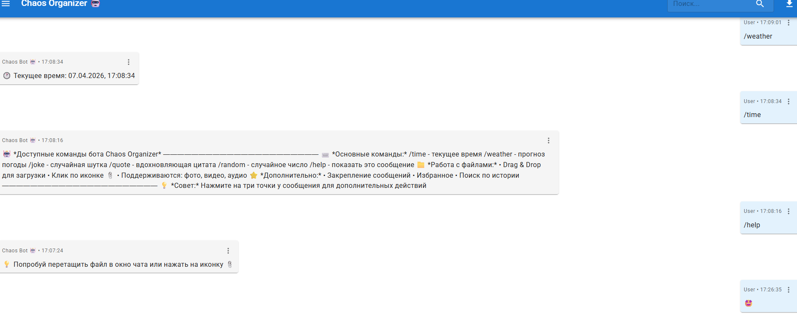
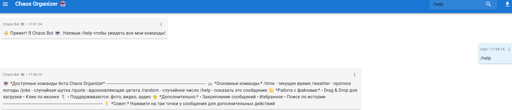
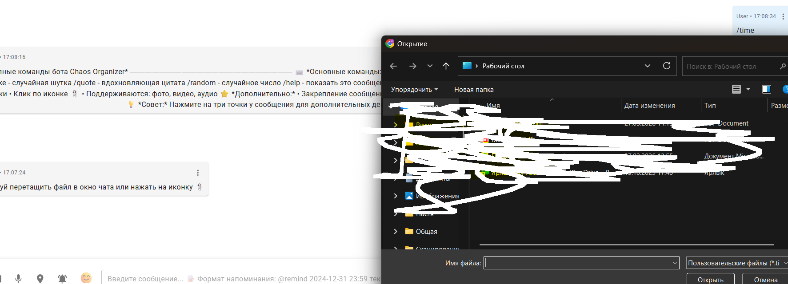
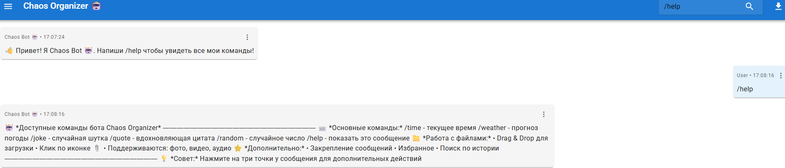
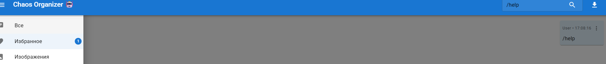

# Chaos Organizer 🤖

Бот-органайзер с функционалом, похожим на мессенджеры (Telegram, WhatsApp, Slack).

## Реализованные функции

### Обязательные (4/4)
- ✅ Сохранение текстовых сообщений и кликабельных ссылок
- ✅ Загрузка файлов (изображения, видео, аудио) через Drag & Drop и кнопку
- ✅ Скачивание файлов на компьютер
- ✅ Ленивая подгрузка (по 10 сообщений при прокрутке)

### Дополнительные (10/5)
- ✅ Синхронизация между вкладками/окнами (WebSocket)
- ✅ Поиск по сообщениям и файлам
- ✅ Запись аудио через микрофон
- ✅ Отправка геолокации
- ✅ Закрепление сообщений (одно сообщение вверху)
- ✅ Избранное с отдельным разделом
- ✅ Команды бота (/help, /time, /weather, /joke, /quote, /random)
- ✅ Напоминания через Notification API
- ✅ Поддержка Emoji
- ✅ Экспорт истории чата в JSON

## Технологии

### Frontend
- React 18
- Material-UI (MUI)
- WebSocket
- Webpack
- Emoji Picker

### Backend
- Node.js + Koa
- WebSocket (ws)
- Multer (загрузка файлов)

## Установка и запуск

### Требования
- Node.js 16+
- npm или yarn

### Установка зависимостей

```bash
# Сервер
cd server
npm install
```

# Клиент
```bash
cd client
npm install
```
Запуск   
Терминал 1 - Сервер:

```bash
cd server
npm start
```
Терминал 2 - Клиент:

```bash
cd client
npm start
```
Приложение откроется на http://localhost:8081

Использование   
Отправка сообщений   
Введите текст в поле ввода и нажмите Enter

Ссылки автоматически становятся кликабельными

Загрузка файлов  
Кнопка 📎 - выбрать файл

Drag & Drop - перетащите файл в окно чата

Команды бота   
```text
Команда	Описание
/help	Список всех команд
/time	Текущее время
/weather	Прогноз погоды
/joke	Случайная шутка
/quote	Вдохновляющая цитата
/random	Случайное число
```
Напоминания
``` text
@remind 2024-12-31 23:59 Встреча с друзьями
```
Действия с сообщениями  
```text
Нажмите на три точки (⋮) у сообщения:

Закрепить - сообщение закрепится вверху

В избранное - добавить в избранное

Скачать - для файлов

Фильтрация (боковое меню)
Все сообщения

Избранное

Изображения

Видео

Аудио

Файлы

Поиск   
Введите текст в поле поиска в верхней панели

Экспорт истории
Нажмите на иконку 📥 в верхней панели
```

Скриншоты
### Основной интерфейс


*Главное окно чата с историей сообщений*

### Команды бота


*Ответ бота на команду /help*

### Загрузка файлов


*Drag & Drop загрузка изображений*

### Поиск


*Поиск сообщений по ключевым словам*

### Избранное


*Раздел с избранными сообщениями*

### Закрепленные сообщения


*Закрепленное сообщение вверху чата*

Структура проекта
``` text
chaos-organizer/
├── server/
│   ├── src/
│   │   └── server.js      # Сервер на Koa
│   ├── uploads/           # Загруженные файлы
│   └── package.json
├── client/
│   ├── src/
│   │   ├── components/    # React компоненты
│   │   ├── services/      # API и WebSocket
│   │   ├── styles/        # CSS стили
│   │   ├── index.html
│   │   └── index.js
│   ├── webpack.config.js
│   └── package.json
└── README.md
```
Возможные проблемы и решения  
Порт 8080 занят
```bash
cd client
npm start -- --port 8081
```
Сервер не запускается
```bash
cd server
npm install
node src/server.js
```
Не работают уведомления  
Разрешите уведомления в браузере при первом запросе

Автор  
Дипломный проект по курсу «Продвинутый JavaScript в браузере»

Лицензия
MIT